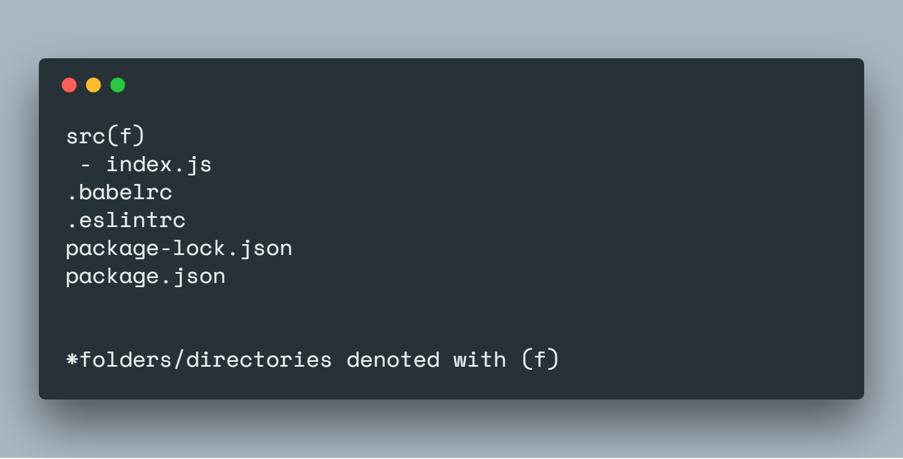
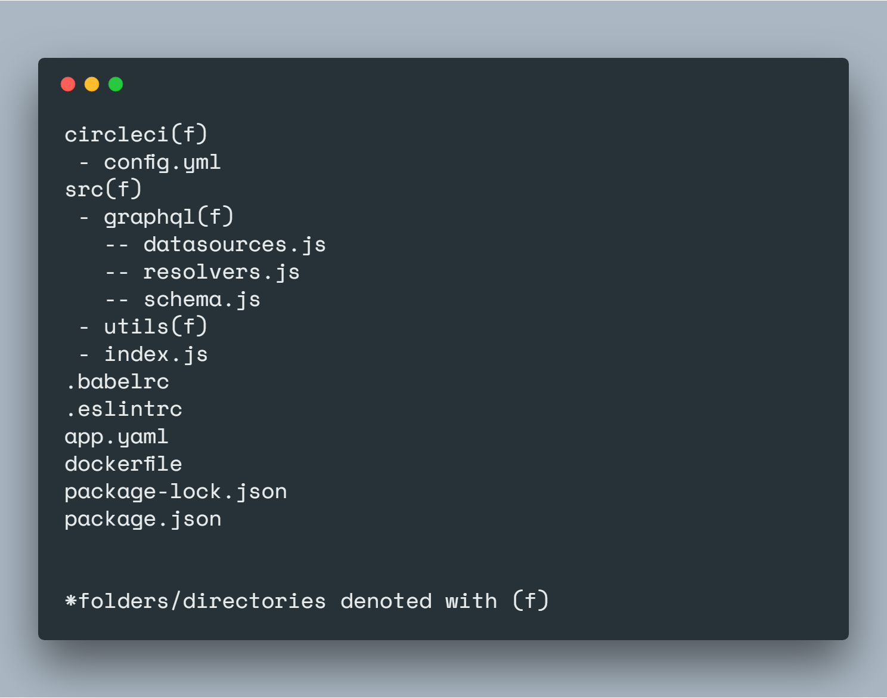

# GraphQL-Server-Kit

Getting Started with a GraphQL Server can sometimes seem intimadating. There's a good amount of overhead involved in set up with redundant code and dependencies. To save time, I built a GraphQL Server Kit for easily getting started with GraphQL with all the necessary and helpful packages pre-installed. The server is built on Node.js with Express.js and GraphQL sitting on top. 
***

## Dependencies

### Server

* [**Apollo Server**](https://www.apollographql.com/server) - An open source solution for easily building a GraphQL API

* [**Express**](https://expressjs.com/) -  Fast, unopinionated, minimalist web framework for Node.js

### Middleware

* [**Cors**](https://github.com/expressjs/cors#readme) - CORS is a node.js package for providing a Connect/Express middleware that can be used to enable CORS with various options.

* [**Helmet**](https://helmetjs.github.io/) - Helmet helps you secure your Express apps by setting various HTTP headers. It’s not a silver bullet, but it can help!  

* [**Compression**](https://github.com/expressjs/compression) - Node.js compression middleware.

* [**Morgan**](https://github.com/expressjs/morgan) - HTTP request logger middleware for node.js

### Development

* [**Babel**](https://babeljs.io/) - Babel is a toolchain that is mainly used to convert ECMAScript 2015+ code into a backwards compatible version of JavaScript in current and older browsers or environments. 

* [**Eslint**](https://eslint.org/) - ESLint is an open source project originally created by Nicholas C. Zakas in June 2013. Its goal is to provide a pluggable linting utility for JavaScript. 

* [**Nodemon**](https://nodemon.io/) - Nodemon is a utility that will monitor for any changes in your source and automatically restart your server.

### Other

* [**Dotenv**](https://github.com/motdotla/dotenv#readme) - Dotenv is a zero-dependency module that loads environment variables from a .env file into process.env. Storing configuration in the environment separate from code is based on The Twelve-Factor App methodology. 

* [**Body-Parser**](https://github.com/expressjs/body-parser) -  Node.js body parsing middleware. Parse incoming request bodies in a middleware before your handlers, available under the req.body property. 

***

## Server Setup

To give a better understanding of the server architecture the server is broken down in stages from a simple express app to full fledged graphql server with middleware and deployment scripts.

### Stage 1: Basic Server

The initial stage is a basic express server with babel, nodemon, and eslint.

#### Folder Structure

Before getting started writing code, babel is installed allowing the use of ES6 and above. 

Next nodemon is a package for automatically restarting a node server speeding up development workflow.
A script is created for running nodemon and babel to transpile the code and start the server.

To type check and ensure no errors are made when writing code ESlint is a great tool. It can be configured to fit your development workflow.

Now with everything configured for development adding express is simple with only a few lines of codes.

### Stage 2: Adding GraphQL & Apollo

With now a simple express server stage 2 builds upon by adding Apollo to transform the server into a GraphQL friendly server.

#### Folder Structure

Incoproating GraphQL into a server is made simpler with Apollo Server a framework for graphql servers. Using Apollo with Express requires one dependency `apollo-server-express`. The sever by default reuires two arguments typDefs and Resolvers. 

The typeDef is your schema and the resolvers functions that resolver request. 

The folder structure will change and graphql directory is added with the schema and resolver inside. Also is the new utils directoy which holds any high order functions that may be used for error handling and other things. 

### Stage 3:  Middleware

The server now has graphql capabilities and if satisfied one can start from this stage when building their server. However since the server is built upon Express it can utilize some of Express great middleware packages.

#### Folder Structure

Express comes with middleware packages for upgrading security, logging, and much more. 

Install helmet, morgan, cors, compression, body parser

### Stage 4: Continious Integration/Deployment

For continious integration and deployment CircleCI is used to trak our builds and ensure all dependencies are implemented properly.

For deployment app.yaml is used for deploying to Google Cloud, specifically App Engine.

For building an image that can be deployed to Kubernetes docker is implemented.

Add circleci, dockerfile, and app.yaml 

